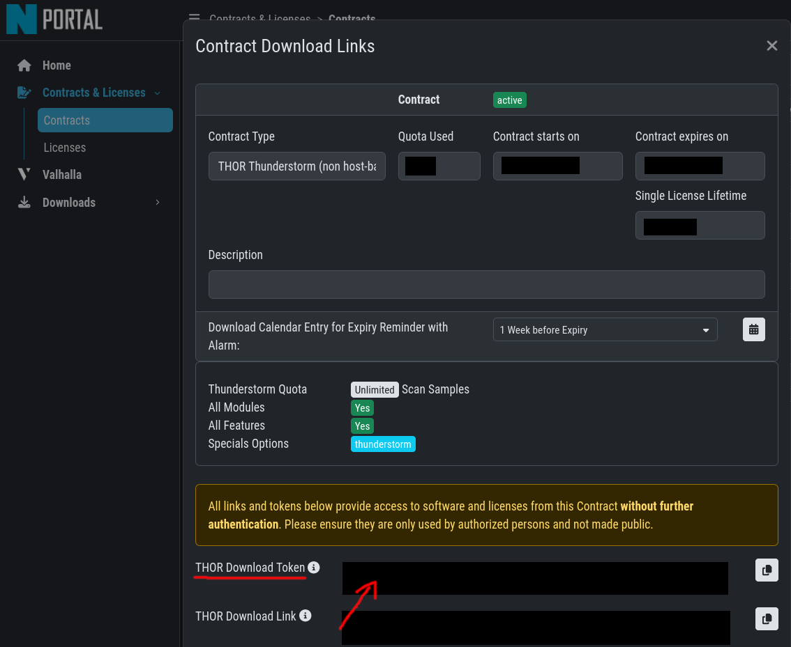

# Deploy Thunderstorm as a Container

[THOR Thunderstorm](https://www.nextron-systems.com/thor-thunderstorm/) is a web service that lets you scan files with our compromise assessment tool THOR through a Web-API. This guide provides a base [container image](https://github.com/NextronSystems/thunderstorm-deployment/pkgs/container/thunderstorm-deployment) and a [Docker Compose template](https://raw.githubusercontent.com/NextronSystems/thunderstorm-deployment/master/docker-compose.yml) so you can run Thunderstorm as a container by providing your contract token.


## Quick-Start

Prerequisites: Docker Engine with the Docker Compose plugin, outbound HTTPS access to the Nextron Portal, and a non-host-based Thunderstorm contract token.

1. Download the [Docker Compose](https://raw.githubusercontent.com/NextronSystems/thunderstorm-deployment/master/docker-compose.yml) file

```bash
curl -O https://raw.githubusercontent.com/NextronSystems/thunderstorm-deployment/master/docker-compose.yml
```

2. Get a contract token from the [Nextron Portal](https://portal.nextron-systems.com/ui/contracts/contracts) (see [Contract-Token](#contract-token))

3. Store the token in an `.env` file next to `docker-compose.yml`

```bash
printf 'CONTRACT_TOKEN=%s\n' '<CONTRACT_TOKEN>' > .env
chmod 600 .env
```

4. Start the service

```bash
docker compose up -d
```

Thunderstorm is exposed on port **8080** by default.

Verify the container reached the API:

```bash
docker compose ps
docker compose logs thunderstorm
curl http://localhost:8080/api/status
```

If you migrate an existing collector that points to another port, update the collectors or override the host port, for example `PORT=8081 docker compose up -d`.

## Contract-Token

Deploying Thunderstorm as a container requires a **non-host-based** Thunderstorm contract with at least one issued license.

On first start, the container uses your contract token to download the THOR binaries and persists them in a Docker volume so subsequent restarts are instant. You can omit the contract token afterwards as long as the volume exists, but keeping it in `.env` makes it available for rebuilds or volume recreation.

A contract token can be retrieved from the [Nextron Portal](https://portal.nextron-systems.com/ui/contracts/contracts) under *Contracts & Licenses → Contracts → Actions → cloud icon → THOR Download Token*.



## Tech-Preview

If you want to use the techpreview channel (currently THOR 11), set `TECHPREVIEW=true`. If `TECHPREVIEW` is later omitted while the Docker volume still contains a techpreview installation, the entrypoint downgrades the installation back to the stable channel.

The compose file contains commented environment variables for all available configuration options. Some options only apply to specific THOR major versions, for example, `QUEUE_WARN_SIZE` is only available for THOR 11.

## Signature Updates

THOR signatures are updated automatically on every container start. To keep them fresh without manual restarts, set `SIGNATURE_UPDATE_INTERVAL` (in hours) to schedule recurring updates.

The update mechanism depends on the THOR major version. On THOR 10, new signatures only take effect after a restart. Docker's health check therefore stops the container once `SIGNATURE_UPDATE_INTERVAL` has elapsed and the restart policy brings it back. The new signatures are then fetched as part of the regular container start, at the cost of a brief API downtime. THOR 11 uses Thunderstorm's built-in signature-update feature to download and apply signatures in-place, leaving the API available throughout.

## Additional Arguments

If you need to customize Thunderstorm itself, use `THUNDERSTORM_ARGS`. If you need to customize THOR scan behavior, use `THOR_ARGS`. For example, to forward scan results to a remote SIEM:

```yaml
environment:
  THOR_ARGS: "--remote-log splunk.intern:514:DEFAULT:TCP --remote-log elastic.intern:1514:JSON:TCP"
```

A full list of all supported arguments can be derived from the THOR binary using `./thor-linux-64 --fullhelp`.

## Optional Persistent Data

The Compose template always persists THOR binaries and signatures in the `thunderstorm` Docker volume. Optional runtime data is stored below `/tmp/thunderstorm` inside the container and is otherwise lost when the container is removed.

- To keep logs, set `LOG_ENABLED=true` and uncomment the `thunderstorm-logs` volume mount.
- To keep VFS mirror data, set `VFS_ENABLED=true` and uncomment the `thunderstorm-vfs` volume mount.

## Cleanup

Stop the service without deleting downloaded THOR binaries:

```bash
docker compose down
```

Remove all persistent container state, including downloaded THOR binaries and signatures:

```bash
docker compose down -v
```

## Security

The communication between a client and the Thunderstorm service could involve sensitive files. Therefore, we highly recommend encrypting the traffic using TLS. With Docker Compose, mount the certificate and private key read-only into the container and set `TLS_CERT` and `TLS_KEY` to the mounted paths. With Kubernetes, use Secret mounts for the same files.

Out of the box, Thunderstorm API is unauthenticated and does not support authentication providers at the moment. If you require an authentication layer, we suggest to use a proxy middleware which delegates the authentication to an external provider such as [Microsoft Entra ID](https://www.microsoft.com/de-de/security/business/identity-access/microsoft-entra-id).

## Limitations

### Load-Balancing
Thunderstorm allows you to send **asynchronous requests** and poll the results using an ID. Currently, Thunderstorm instances do not share their results with each other. If you run multiple Thunderstorm containers behind a load-balancer and request the results of an async request, you may not get the result from the correct Thunderstorm instance. We recommend to use async requests in combination with remote logging only in a load-balancer setup.
